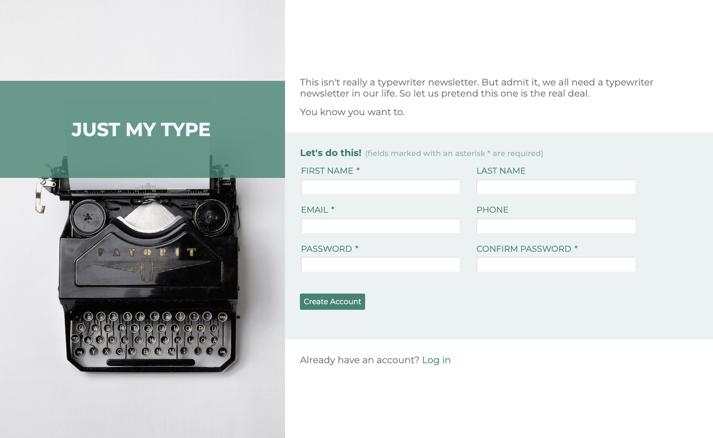

# Sign Up Form Project

## Result
[Test my sign up form Live here](https://manonlef.github.io/Sign-Up-Form/)

## About this project 
This project is intended to put in practice some skills learned about forms and their validation.
The topics leading up to this project ranged from tables to accessibility so I tried to implement some of the other things I picked up along the way as well.

## Objective
The objective was to rebuild a signup form from the design file example provided. 

- [x] create a sign up form design similar to the example provided

## My Personal Objectives
I wanted to take this project a bit further and put in practice all the extra reading I did on visual feedback during filling out a form. Personally I can't always put my finger on why I don't appreciate certain input behaviour on sites but most of it seems to come down to feedback during the filling out phase. To accomplish all the active feedback during the input phase I had to actually implement JS. This was extra since the exercise didn't require any JS. I decided to also use JS for better email valildation and password confirmation.

I also wanted to replace the default html form styling mostly to give the form a very similar experience across browsers. 

Lastly I decided to try my hand at making it responsive through usage of flex properties. 

- [x] responsive design
- [x] similar cross browser experience by removing default formatting
- [x] active feedback throughout filling out the form for a better user experience
- [x] use JS to accomplish the above and better validation

## Notes and lessons learned
- There's quite a lot of information about accessibility that piqued my interest. It's also a huge rabbit hole filled with information. I decided to settle on active feedback and implemented symbols as well for those with color blindness.
- If I stuck to the basics, I'd have finished this in a fraction of the time. The active validation feedback wasn't as straight forward as I thought and there's not a fixed set of rules on best practices either.
- I felt more intimidated by the project than needed. Most of the hardships were self inflicted by adding non-mandatory functionality. I'd do it all again since I do feel this brought together a lot of the topics covered leading up to the project.

## Things to improve when revisiting this project
- [ ] Simplify the JS code. Add some functions for the class changes and accompanying messages.
- [ ] Add account creation confirmation 